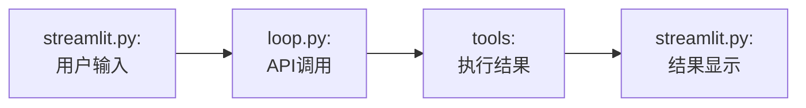
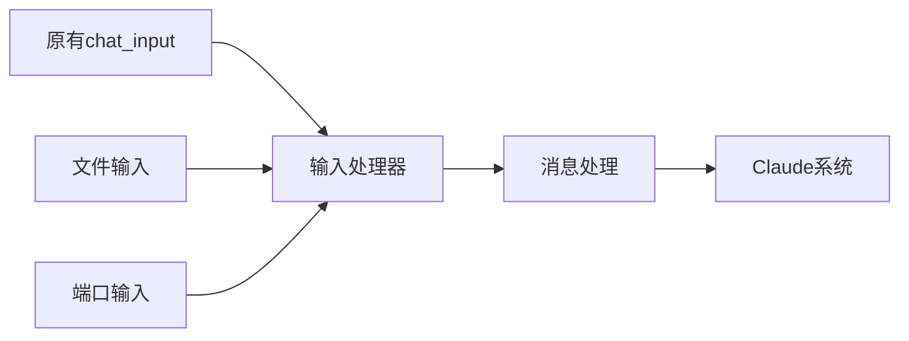
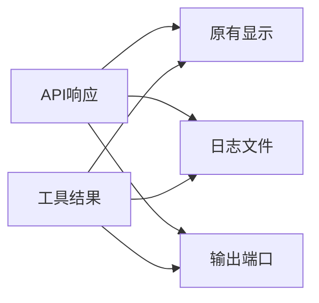

# Claude 输入输出处理扩展方案

## 1. 现有系统关键点


## 2. 输入扩展设计

### 2.1 输入层注入点
在streamlit.py的new_message处理处添加输入源:


### 2.2 自定义输入源
- 文件监听
  
  监听指定文件变化，读取新增内容，然后转换为消息格式
  
- 端口监听
  
  监听指定端口，接收外部输入，格式化消息

### 2.3 输入处理流程


## 3. 输出扩展设计

### 3.1 输出层注入点
在loop.py的回调函数处添加输出处理:


### 3.2 输出处理器
- 日志记录器
  
  记录API请求响应，记录工具执行结果，记录系统状态
- 端口输出器
  
  转发执行结果，发送状态更新，错误通知

### 3.3 输出格式定义
```python
{
    "type": "api_response/tool_result",
    "timestamp": "ISO时间戳",
    "content": {
        "message": "具体内容",
        "status": "状态信息",
        "error": "错误信息(如果有)"
    }
}
```
